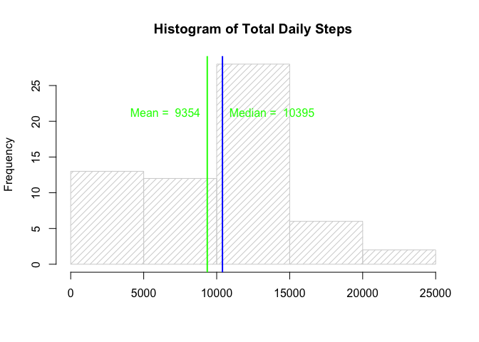
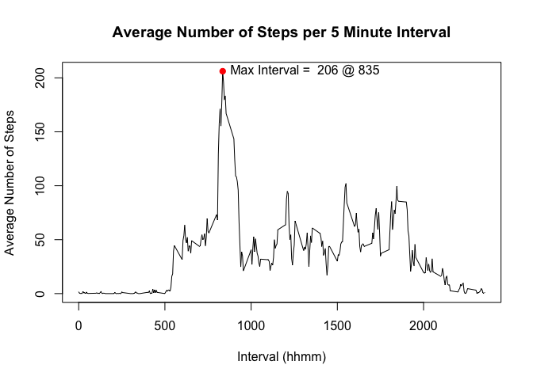
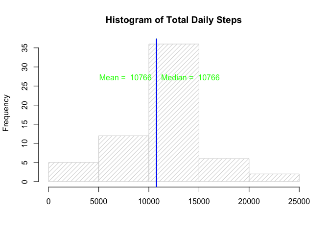
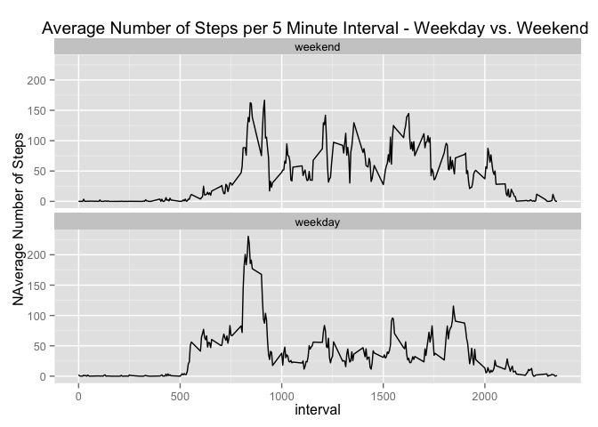

# Reproducible Research: Peer Assessment 1
##Overview
This report is the first of two projects that are part of the reproducible research course provided by Johns Hopkins University on Coursera.  The purpose of this report is to download, analyse and provide graphics of number of steps collected by a personal activity monitoring device at 5 minute intervls over the period of October and November, 2012. 

## Loading and preprocessing the data
The following code loads the required libraries and then loads the activity data from the activity.csv file located in the activity.zip file. After loading the data, it is processed. 

The data is processed by:  
-Converting the dates to POSIXct format.  
-Adding a column for day of the year.  
-Adding a column for whether it is a weekday or weekend.  
-Make two grouped data sets, grouped by day and interval respectively

The code for to complete the loading and processing of data is shown below.


```r
# load libraries
library(lubridate)
library(dplyr)
```

```
## 
## Attaching package: 'dplyr'
## 
## The following objects are masked from 'package:lubridate':
## 
##     intersect, setdiff, union
## 
## The following object is masked from 'package:stats':
## 
##     filter
## 
## The following objects are masked from 'package:base':
## 
##     intersect, setdiff, setequal, union
```

```r
library(ggplot2)
```

```
## Warning: package 'ggplot2' was built under R version 3.1.3
```

```r
#Load activity.csv from inside the activity.zip file
data_csv = read.csv(unz("activity.zip","activity.csv"))
data_csv = mutate(data_csv, date = as.POSIXct(date, format = "%Y-%m-%d"))
data_csv = mutate(data_csv, day = factor(yday(date)))
data_csv = mutate(data_csv, wday = factor(wday(data_csv$date) %in% c(2:6), labels = c("weekend", "weekday")))


data_day = group_by(data_csv, day)
data_interval = group_by(data_csv,interval)
```


## What is mean total number of steps taken per day?
The total number of steps per day was calculated and the result was plotted in a histogram, see figure below.  


```r
# Calculate the total number of steps taken daily
total_steps = summarise(data_day, DailySteps = sum(steps, na.rm = TRUE))
#Calculate mean and median
mean_dailysteps = round(mean(total_steps$DailySteps, na.rm = TRUE),0)
median_dailysteps = round(median(total_steps$DailySteps, na.rm = TRUE),0)


# plot histogram of daily steps
plot_hist <- function(total,mean,median ){
h = hist(total$DailySteps, freq = TRUE, xlab = "", main = "Histogram of Total Daily Steps", col = "lightgrey", density = 15)

#add mean and median to plot
abline(v = mean, col = "green", lwd = 2)
abline(v = median, col = "blue", lwd = 2)

#add text to identify mean and median to plot
text(mean , max(h$counts)*.75, paste("Mean = ",mean),, pos = 2, col = "green")
text(median , max(h$counts)*.75, paste("Median = ",median), pos = 4, col = "green")
}

plot_hist(total_steps, mean_dailysteps, median_dailysteps)
```

 

From this information the mean and median step per day values were calculated.  The result for mean and median steps per day is 9354 and 1.0395\times 10^{4}, respectively.

## What is the average daily activity pattern?

The average number of steps for each 5 minute interval over the period of data collection was calculated and the results were plotted as a timeseries.  The code for this anaylsis is below as well as the figure showing the results.


```r
#function to calculate number of NA values
num_na <- function(data){
  nas = sum(is.na(data))
}

#function to calculate data availability
availability <- function(data){
  avail = (1 - num_na(data)/length(data))*100
}
#Calculate interval averages
ave_interval = summarise(data_interval, IntervalAverage = mean(steps, na.rm = TRUE))

#Plot the interval averages
plot(ave_interval$interval, ave_interval$IntervalAverage, type = 'l', xlab="Interval (hhmm)", ylab = "Average Number of Steps", main = "Average Number of Steps per 5 Minute Interval")

#calculate max value and add to plot
max_interval_val = max(ave_interval$IntervalAverage, na.rm = TRUE)
max_interval = ave_interval$interval[ave_interval$IntervalAverage == max_interval_val]

points(x =max_interval,y = max_interval_val, col = "red", pch = 19)
text(max_interval, max_interval_val, paste("Max Interval = ", round(max_interval_val,0), "@" , max_interval), pos = 4)
```

 

The figure shows the average number of steps per 5 minute interval, with the max interval average of 206.1698113 steps at 835.  Quick observations from the data:  
-The steps are almost zero from approximately 22:00 until just after 05:00.  Suggesting they get roughly 7 hours of sleep per night.  
-The max value occurs at 08:35 with higher than average values for about a half hour on either side of this.  This may suggest a morning jog.  It may also suggest walking to work, although the lack of a peak in the evening suggests that is not the case or they take an alternate form of transportation home.  
-The plot is in alignment with what would be expected of a typical person's daily routine.

## Imputing missing values
The missing data from the data sets was calculated in the code below.

```r
#Calculate the number of missing values as number and as percent
missing = sum(is.na(data_csv$steps))
as_percent = round(1-missing/length(data_csv$steps),2)*100
```
The total number of missing intervals was 2304, or approximately 87%.  This could have an impact on the results, so the missing data was filled in by imputing values for each 5 minute interval based on the 5 minute averages calculated previously.    


```r
#Impute values for the missing data using a for loop
data_impute = vector()
for (i in c(1:length(data_csv$steps))){
  temp = vector()
  #check if data is missing
  if (is.na(data_csv$steps[i])){
    #missing data is imputed using the average of the five minute interval calculated previously
    temp = ave_interval$IntervalAverage[ave_interval$interval == data_csv$interval[i]]
  }else{
    temp = data_csv$steps[i]
  }
  data_impute = c(data_impute,temp)
}
#format the data into a data fram and add the days column
data_impute = data.frame(steps = data_impute)
data_impute = cbind(data_impute, select(data_csv, day, interval, wday))
data_impute_day = group_by(data_impute, day)
```

The total number of steps taken per day was re-calculated using the imputed data and the results were plotted to a histogram with the mean and median values.


```r
# Calculate the total number of steps taken daily
total_steps_imp = summarise(group_by(data_impute_day,day), DailySteps = sum(steps, na.rm = TRUE))
#Calculate mean and median
mean_dailysteps_imp = round(mean(total_steps_imp$DailySteps, na.rm = TRUE),0)
median_dailysteps_imp = round(median(total_steps_imp$DailySteps, na.rm = TRUE),0)

plot_hist(total_steps_imp, mean_dailysteps_imp, median_dailysteps_imp)
```

 

The histogram of the imputed data set more closely resembles a normal distribution than the original data and the mean and median both increased from 9354 to 1.0766\times 10^{4} and 1.0395\times 10^{4} to 1.0766\times 10^{4}, respectively.  These two changes in the data support one another as the original data has more mass between 0 and 5000, so it makes sense that the mean and median would increase as a result of the changes.  I may be valuable to further explore the implications of imputing using more sophisticated methods, although given how readily available this form of data is likely to be it might be more worthwhile to increase teh amount of data.

## Are there differences in activity patterns between weekdays and weekends?

The difference in activity patterns between weekays and weekends was also evaluated.  A panel plot of the respective weekday and weekend 5 minute intervals was created to complete the evaluation.  


```r
#Calculate interval averages
data_impute_wday = group_by(data_impute, wday, interval)
wday_interval = summarise(data_impute_wday, IntervalAverage = mean(steps, na.rm = TRUE))

#Plot the interval averages for weekends and weekdays 
ggplot(wday_interval, aes(interval,IntervalAverage))+ geom_line() +facet_wrap(~wday,ncol = 1)+labs(y = "NAverage Number of Steps", title = "Average Number of Steps per 5 Minute Interval - Weekday vs. Weekend ")
```

 

The figures show a difference between activity on the weekends versus weekdays.  The weekend show a bit of a slower start to the day, but it appears as though there is still a peak of slightly smaller magnitude around the 830 to 930 timeframe.  This may suggest there is a weekend morning run, but they ease off a little bit.    The activity during the weekends stays higher throughout the day than during the week.  The subject appears to have a healthy social life as the weekend activity persists later into the evening than it does during the week.  I would consider being friends with this person, but further analysis is required.
